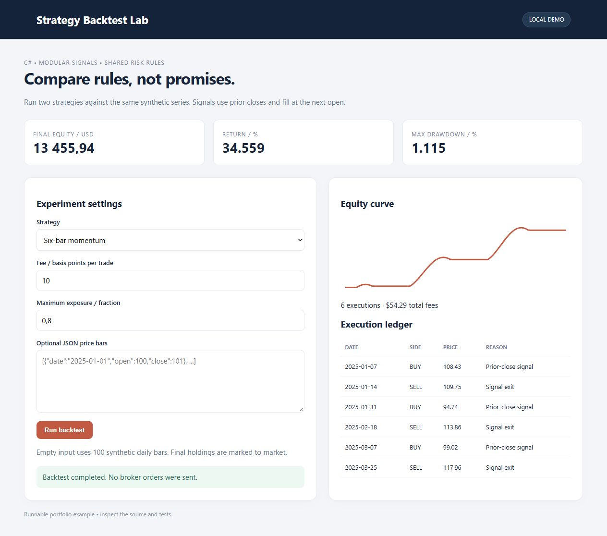

# Strategy Backtest Lab

A modular C# engine with shared fees, position sizing, drawdown tracking and two interchangeable strategies.



## Run and test
.NET 8 SDK, no NuGet package dependencies:
```sh
dotnet restore
dotnet run -- --self-test
dotnet run
```
Open http://127.0.0.1:8765. Set `PORT` to change it. Tests are a dependency-free console suite and fail with a nonzero exit on any assertion.

## Execution model
SMA crossover (5/12 bars) and six-bar momentum use closes strictly before the execution bar. Orders fill at the next bar's open. Fees are charged on both sides; position sizing includes entry fees in the cash budget. A prior-close stop triggers an exit at the next open, so gaps can exceed the stop threshold. A stopped position cannot reopen on the same bar.

Equity is marked at every close. The final position is marked to market, **not forcibly liquidated**, so hypothetical exit costs are not deducted from final equity. Prices have no volume model, spread or slippage; there is no leverage or shorting. Input dates must strictly increase. The dashboard uses explicitly synthetic data and accepts pasted JSON bars with `date`, `open`, `close` fields (15–5000 bars).

## Design
`IStrategy` separates signals from execution; `Settings` applies shared risk controls. `Engine.cs` is independent of the ASP.NET Core adapter. `Tests.cs` checks fees/cash conservation, future-data independence for both strategies, stop timing and invalid dates.

This is a local portfolio example, not a forecast or investment recommendation. The loopback dashboard has no public account system. No broker or trading account is connected.
